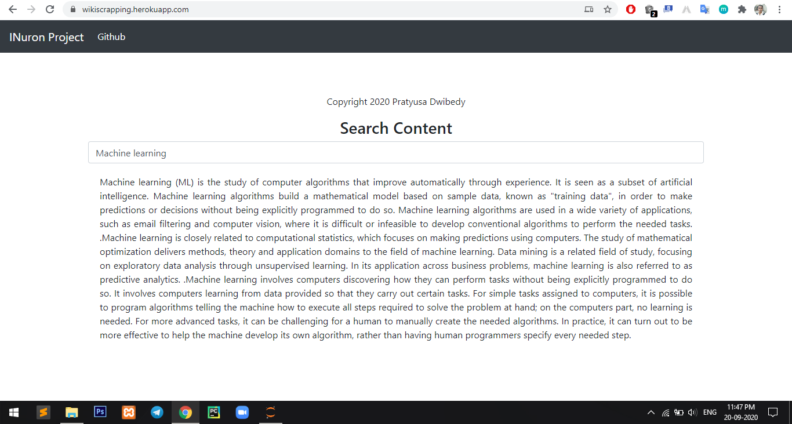

# web_scrapping_project

### Link Of My Project:  https://wikiscrapping.herokuapp.com/

In this project I am scrap the data from weikipedia.
## What Is Web scraping?
Web scraping is a technique using which the webpages from the internet are fetched and parsed
to understand and extract specific information similar to a human being. 

### Web scrapping consists of two parts:
• Web Crawling→ Accessing the webpages over the internet and pulling data from
them.  
• HTML Parsing→ Parsing the HTML content of the webpages obtained through web
crawling and then extracting specific information from it.

## Demo Of My Project

##  Applications of web scrapping are:
• Competitive pricing. 
• Manufacturers monitor the market, whether the retailer is maintaining a minimum price
or not. 
• Sentiment analysis of the consumers, whether they are happy with the services and
products or not. 
• To aggregate news articles. 
• To aggregate Marketing data. 
• To gain financial insights from the market. 
• To gather data for research. 
• To generate marketing leads. 
